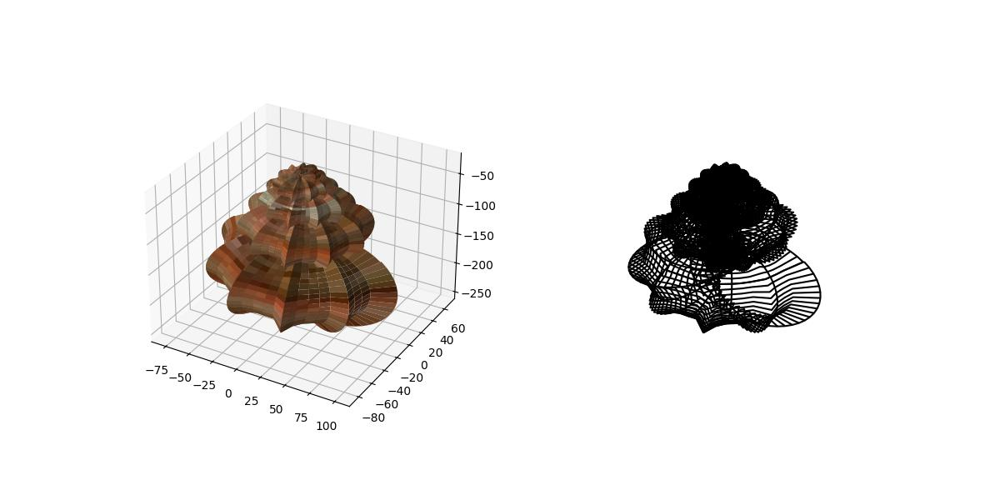

# Seashell Modelling

This repository contains a Python script that generates a 3D plot of a seashell 
using the mathematical model described in Jorge Picado's 2009 paper: *SEASHELLS: 
THE PLAINNESS AND BEAUTY OF THEIR MATHEMATICAL DESCRIPTION*. The script allows 
for customization of various parameters to produce different seashell shapes.

## How to Use

1. **Clone the repository:**

   ```bash
   git clone <repository-url>
   cd <repository-directory>

### Install library requirements

To run the script, you need to have the following Python libraries installed:

- `numpy`
- `matplotlib`

You can install these libraries using pip:

```bash
pip install numpy matplotlib
```

### Run the script

Execute the script using Python:

```bash
python main.py
```

### Customizing Parameters

The script accepts several parameters that control the shape of the seashell. 
These parameters can be modified directly in the `main()` function call within the script.

```python
main(D=1, A=100, alpha=95*np.pi/180, beta=25*np.pi/180,
     mu=0*np.pi/180, omega=0*np.pi/180, phi=360*np.pi/180,
     a=10, b=20, L=0, P=0, W1=0, W2=0, N=0, image="shell")
```

**Parameter Descriptions:**

- `D` : Direction of coiling (`1` for dextral, `-1` for sinistral).
- `A` : Size of the spiral aperture.
- `alpha` : Equiangular angle of the spiral.
- `beta` : Enlarging angle of the spiral.
- `mu` : Rotation around the horizontal axis.
- `omega` : Rotation around the OZ axis and horizontal axis.
- `phi` : Rotation around a vector orthogonal to the ellipse plane.
- `a` : Semimajor axis of the generating curve (ellipse).
- `b` : Semiminor axis of the generating curve (ellipse).
- `L` : Height of each nodule.
- `P` : Position angle of the nodule on the generating curve.
- `W1` : Length of each nodule along the generating curve.
- `W2` : Length of each nodule along the helico-spiral.
- `N` : Number of nodules per complete revolution.
- `image` : Name of the (JPG) image to use to colour the surface. 

# Example Shell Figure

Here is an example of a shell figure generated using the code in this repository:



## References

This code is based on the mathematical model described in:

**Jorge Picado (2009)**, *SEASHELLS: THE PLAINNESS AND BEAUTY OF THEIR MATHEMATICAL DESCRIPTION*, 
[Read the paper](https://www.mat.uc.pt/~picado/conchas/eng/article.pdf#toolbar=0).
